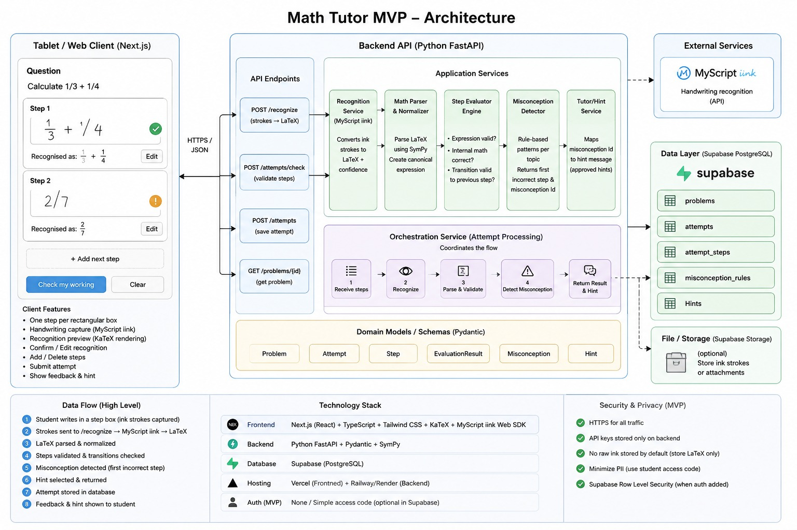

# Math Tutor MVP — Architecture

An editable version of this diagram now also exists:
[`math_tutor_mvp_architecture.drawio`](math_tutor_mvp_architecture.drawio) (open in
[diagrams.net](https://app.diagrams.net)). It was reviewed against the actual
implementation on 2026-08-10 and corrected where it had drifted — see that file for the
current state. Corrections made: the Recognition Service's stale "+ confidence" claim
(same issue as below); the Frontend tech stack wrongly listing the MyScript client SDK
(ink capture is a plain `<canvas>`, deliberately not the SDK, so `MYSCRIPT_APP_KEY`/
`HMAC_KEY` stay backend-only per #48) and TypeScript (the app is plain JavaScript); the
Misconception Detector and Tutor/Hint Service boxes being drawn as implemented when
`misconception_id` is hardcoded `null` and hints are a single static string (2nd MVP
scope, not built yet); the missing `GET /problems/random` endpoint (#64, now the primary
way problems load); the Orchestration Service's flow not matching `run_pipeline()`'s real
stages; and the security list's RLS line, which implied it was just "pending auth" rather
than structurally moot today (backend uses one shared `service_role` connection that
bypasses RLS by design — ticket #51's finding).

## Known inaccuracy in the static image above

The **Recognition Service** box says it "Converts ink strokes to LaTeX + confidence."
That's stale: on 2026-08-01 the team resolved (ticket #21 on the task board) that
MyScript's math recognition API has no confidence field to return. The actual
`/recognize` endpoint (ticket #19, done) returns `{ latex }` only — the frontend
always shows a Confirm/Edit step instead of thresholding on a confidence score.

This static JPEG is not being kept in sync going forward — the `.drawio` file above is
the maintained version.
