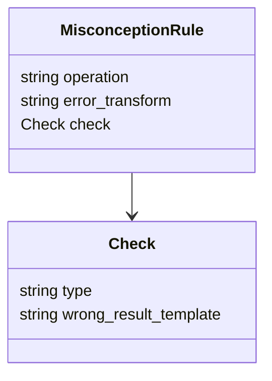
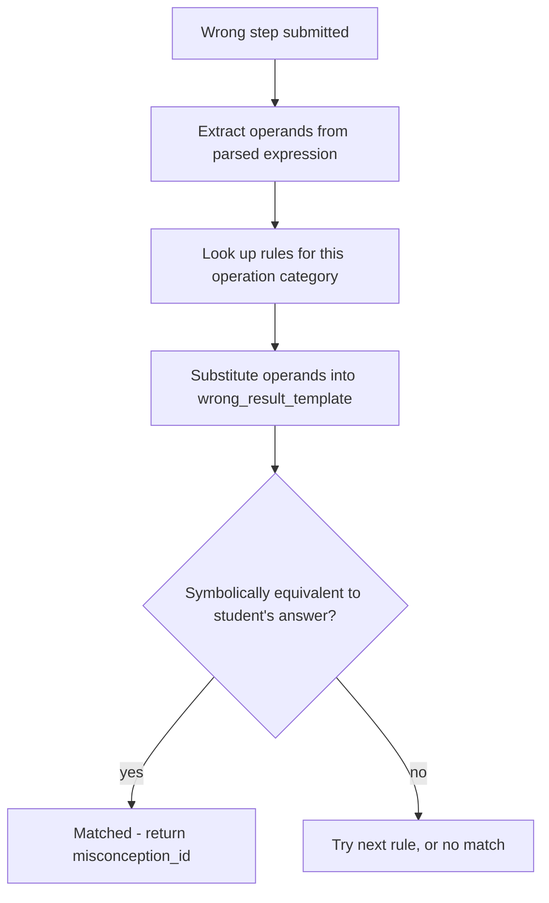
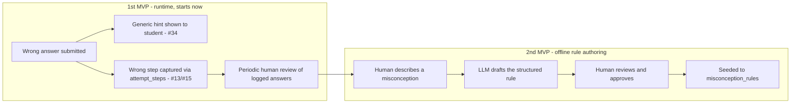

# Proposal: Misconception rule format (Task #29)

**Status:** Proposed — awaiting review from Jeff and Richard before content seeding (#9)
begins, per #29's own AC. See `docs/tracking/decision-log.md` for the full decision record.

**Already decided, not re-opened here** (see `decision-log.md`): `matching_rule` is
structured comparison against the parsed SymPy expression tree — not regex, not plain
text — stored as `jsonb`. This proposal is the missing piece: the actual field-level shape
of that JSON.

**Scoping:** given time pressure toward the 2026-08-22 MVP goal, implementing this format
(#30's matching engine, #9's real seed content) is deferred to a 2nd MVP. 1st MVP ships the
Evaluator (#25-28) and the generic fallback hint (#34) regardless — neither needs
misconception-specific matching. Shadow logging (Fig. 2) starts in 1st MVP anyway, so real
usage data is already accumulating by the time 2nd MVP begins.

---

## Fig. 1 — The rule shape

Two concrete examples, same shape:

| operation | error_transform | check.type | wrong_result_template |
|---|---|---|---|
| fraction_addition | add_numerators_and_denominators | symbolic_equivalence | `(a+c)/(b+d)` |
| fraction_subtraction | subtract_numerators_and_denominators | symbolic_equivalence | `(a-c)/(b-d)` |

The first row is the canonical example used throughout this project's design discussion:
`1/3 + 1/4 = 2/7` — a student adding numerators and denominators straight across instead of
finding a common denominator.

How a rule actually gets matched against a wrong step:

**Notes:**
- `operation` categorizes the problem type (fraction addition, percentage conversion, ...).
- `error_transform` names the specific known mistake — documentation/logging value, not
  matched on directly.
- `check.type` is a small, fixed, extensible vocabulary. Starts with just
  `symbolic_equivalence`; new types (e.g. for decimal/percentage errors) can be added later
  without touching existing rules.
- Exact operand-extraction mechanics (how `a, b, c, d` get pulled from the parsed expression)
  are #30's job to implement against this format — not decided here.
- `description` (already on the `Misconception` model) should stay genuinely descriptive,
  not a terse label — it's a forward-compatible input for an eventual AI semantic fallback
  (see `system-design.html` Fig. 4's caption), not built now.

Adding a new misconception means adding a new JSON row in this shape — never touching #30's
matcher code, unless it's a genuinely new `check.type`, which should be rare. That's the
scalability property this format is built around.

---

## Fig. 2 — Rule authoring & shadow logging

1st MVP has no `misconception_rules` seeded yet, so every wrong step is inherently
"unmatched" — the right-hand loop below runs from day one, not just once #30/#9 exist.

**Left loop (2nd MVP):** same AI-assisted-authoring pattern already committed to for
`Problem.solving_tip` — a human describes a misconception in plain language, an LLM drafts
the structured rule from known `error_transform` examples, a human reviews and approves
before it's seeded. AI stays in the safe, offline, human-reviewed authoring path.

**Right loop (1st MVP, starts now):** no new logging infrastructure needed —
`attempt_steps` (`recognized_latex`, `is_correct`) already captures every wrong step once
#13/#15 ship, joinable back to `problems.correct_answer`. The only real work is making that
data queryable for review. This feeds #61 ("Expand misconception rule library from real
usage data," already Post-MVP-backlogged) instead of competing with it — 2nd MVP's rule set
gets built from real groep 7/8 mistakes, not guesswork made under this MVP's time pressure.

**Deliberately not proposed:** calling an LLM on every single answer check in real time.
Considered and rejected — it breaks hint escalation (no stable `misconception_id` without
deterministic matching), risks an incorrect or answer-revealing hint reaching a real child
with no human review, adds per-request cost the README asks to minimize, adds latency to
what should be immediate feedback, and isn't testable the way #26's "no false positives"
AC requires. AI belongs in the two loops above — authoring and offline pattern-mining — not
the student-facing hot path.
