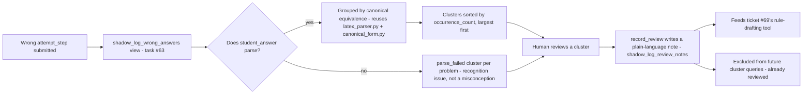

# Reviewing shadow-logged wrong answers (tasks #63, #68)

## What this is

Every wrong step a student submits already gets saved (`attempt_steps.is_correct = false`,
via task #15) — no extra work needed to capture it. This doc is about *reviewing* that
data — turning raw rows into repeated, actionable patterns, and tracking what's already
been looked at — not storing it.

## Why it exists

2nd MVP's misconception-matching engine (#30) needs real rules built from real groep 7-8
usage data, not guesswork under 1st MVP's time pressure. The shadow log is the raw
material for that; ticket #68 turns it into something actually reviewable as it grows,
feeding ticket #69's LLM-assisted rule-drafting tool with real, human-written
plain-language descriptions instead of a wall of individual rows.

## The workflow



Clustering groups wrong answers by *mathematical* equivalence, not exact text match —
`2/7` and `2 / 7` land in the same cluster, reusing the same `are_equivalent()` logic
already built and tested for comparing a student's answer to the correct one
(`backend/canonical_form.py`). Answers that don't parse at all land in their own
`parse_failed` cluster per problem instead of being silently dropped — that's a genuinely
different, still-useful signal (a recognition issue, not necessarily a math mistake).

## How to use it

From `backend/`, with real Supabase credentials configured (`backend/.env`):

```python
from shadow_log_review import get_wrong_answer_clusters, record_review

# Largest, most-actionable patterns first. Already-reviewed clusters are excluded.
clusters = get_wrong_answer_clusters()

# Or scoped to one problem:
clusters = get_wrong_answer_clusters(problem_id=12)

# Once you've looked at a cluster and decided it's a real, worth-seeding pattern:
record_review(
    problem_id=12,
    representative_answer="2/7",
    note="Adds numerators and denominators straight across instead of finding a common denominator",
    status="reviewed",  # or "drafted" once ticket #69 has turned it into a real rule
)
```

`record_review()`'s `note` is the plain-language description ticket #69's LLM-assisted
rule-drafting tool consumes directly — this is the actual "output feeds directly into
#69" link, not just a reference.

You can still browse the raw `shadow_log_wrong_answers` view directly in Supabase's SQL
Editor or Table Editor for ad hoc lookups — the clustering above is a workflow on top of
it, not a replacement for direct access when you need it.

No new access control — everything here reads/writes through the same
`service_role`/RLS setup (#10) the rest of the backend already uses.
